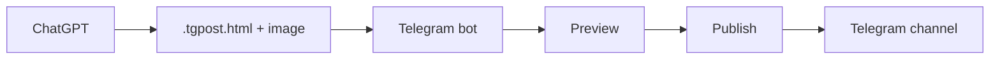

# Telegram Post Renderer

Send a `.tgpost.html` file to Telegram, preview its native formatting, and publish it directly to a channel.

`ChatGPT -> .tgpost.html + image -> Telegram bot -> Preview -> Publish -> Channel`

## Why

Copying rich text between ChatGPT, iOS, macOS, Windows, and Telegram can lose or corrupt formatting. This bot avoids the clipboard: Telegram Bot API renders and publishes the HTML entities directly.

## Features

- Telegram Bot API HTML rendering from `.tgpost.html` input
- Native formatted preview with a direct **Publish** action
- Optional single image per post, stored as a Telegram `file_id`
- HTML media caption when it fits; image plus full formatted text when it does not
- Single-user allowlist and long polling
- No database; unpublished drafts are in memory only

## Workflow



Send an image first, then the `.tgpost.html` document. The preview shows the image and formatted post separately; the image is bound to that preview. Sending a newer image replaces the pending one. A post without an image continues to work normally.

## Example `.tgpost.html`

```html
<b>Open-source alternatives</b>

<a href="https://github.com/twentyhq/twenty">Twenty</a> replaces <code>Salesforce</code>.

<blockquote>Keep the workflow simple: preview, then publish.</blockquote>

<pre><code class="language-powershell">gh repo clone twentyhq/twenty</code></pre>
```

Use only [Telegram Bot API HTML formatting](https://core.telegram.org/bots/api#html-style). The bot passes the HTML to Telegram unchanged; it does not convert it to Markdown.

## Setup

Python 3.12+ is recommended.

```powershell
py -3.12 -m venv .venv
.\.venv\Scripts\Activate.ps1
pip install -r requirements.txt
Copy-Item .env.example .env
```

On Linux, create and activate a virtual environment with `python3 -m venv .venv` and `source .venv/bin/activate`.

## Environment

```env
TELEGRAM_BOT_TOKEN=
ALLOWED_USER_ID=
TELEGRAM_CHANNEL_ID=
```

- `TELEGRAM_BOT_TOKEN` — token for the bot.
- `ALLOWED_USER_ID` — numeric Telegram user ID permitted to send drafts and publish.
- `TELEGRAM_CHANNEL_ID` — target channel username (for example `@channel`) or numeric chat ID. The bot must be an administrator there.

Keep `.env` private; it is ignored by Git.

## Run

```powershell
python -m src.bot
```

## VPS

The production deployment uses a Python virtual environment, `systemd`, and Telegram long polling. No inbound web server or webhook is required.

## Tests

```powershell
pytest
```

## Project structure

```text
src/bot.py               Bot, draft state, and Telegram handlers
tests/test_post_files.py Focused behavior tests
.env.example             Safe configuration template
```
